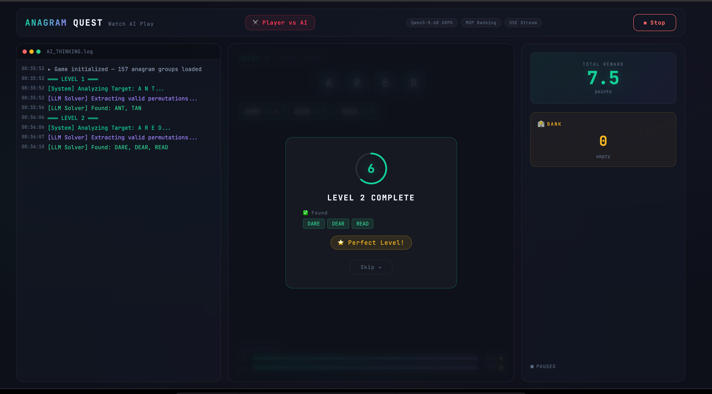
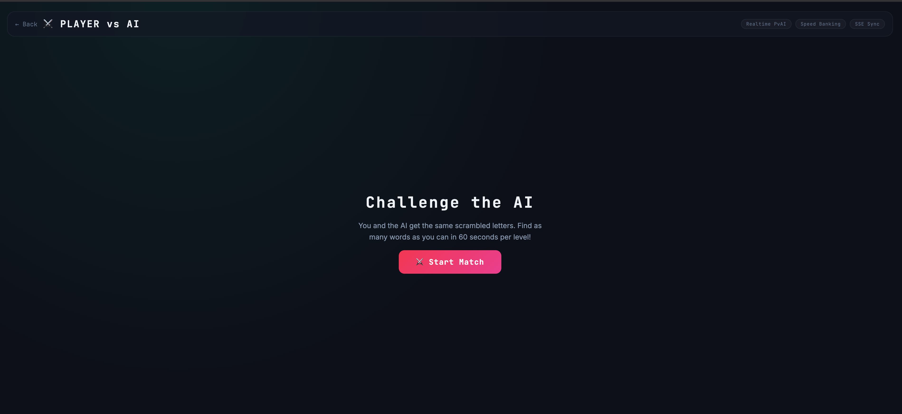
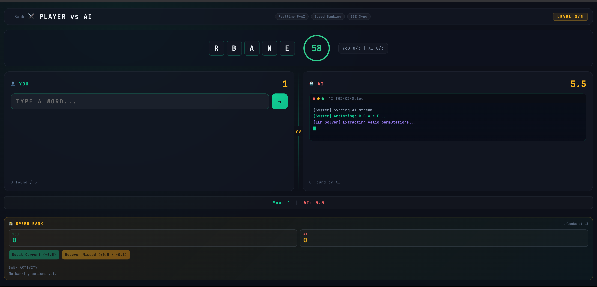
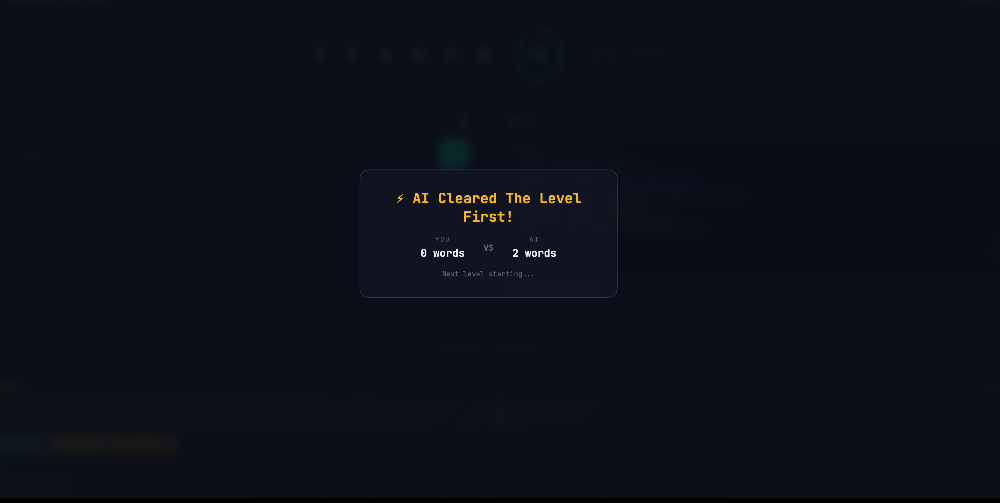
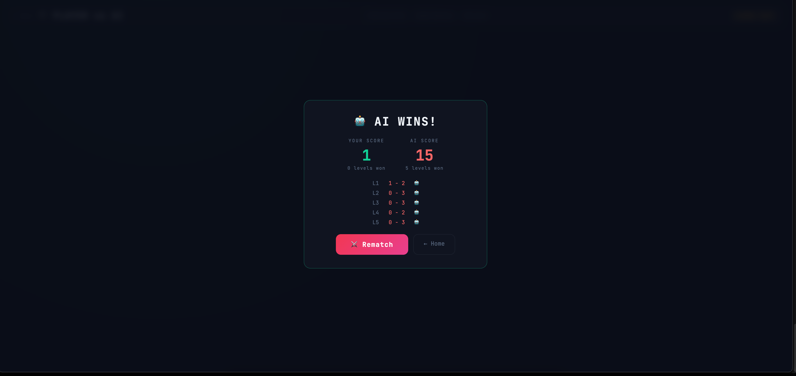
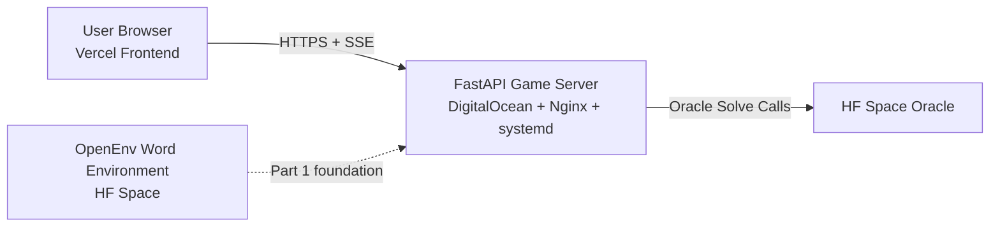

# Anagram Quest — End-to-End AI Game System

A portfolio flagship that documents the full engineering journey of **Anagram Quest** from OpenEnv environment design to production PvAI deployment.

This repo is the **master narrative + architecture index** for the project family.

## Live Links

- OpenEnv Game (Part 1): [ailanidivyansh-word-guessing-env.hf.space/web](https://ailanidivyansh-word-guessing-env.hf.space/web)
- PvAI Frontend (Part 2): [anagram-quest-frontend.vercel.app/vs](https://anagram-quest-frontend.vercel.app/vs)
- Backend Health: [anagram-quest.mooo.com/health](https://anagram-quest.mooo.com/health)

## Visual Preview

OpenEnv screenshots live in the Part 1 repo docs to avoid duplicate heavy scrolling here:
[anagram-quest-openenv/docs](https://github.com/divyanshailani/anagram-quest-openenv/tree/main/docs)

### PvAI Production Snapshots

  
  

  
View More PvAI Screenshots

  

    
    
  

  

    
  

## Project Family (Source Repos)

| Layer | Repo | Role |
|---|---|---|
| Part 1 | [anagram-quest-openenv](https://github.com/divyanshailani/anagram-quest-openenv) | RL-ready word-guessing environment + web UI |
| Part 2A | [anagram-quest-server](https://github.com/divyanshailani/anagram-quest-server) | FastAPI game master, SSE, MDP banking, Oracle integration |
| Part 2B | [anagram-quest-frontend](https://github.com/divyanshailani/anagram-quest-frontend) | Next.js premium UX, Watch mode + Player vs AI |

## Why This Repo Exists

The implementation is intentionally split across repos for deployment clarity, but recruiters need one place to understand:

1. What was built
2. Why architecture choices were made
3. Which production issues were solved
4. How the system evolved from prototype to stable product

This repository answers that end-to-end.

## Architecture Overview

## Journey Timeline (Condensed)

- **Phase 1 (Mar 18-19, 2026):** Local MLX inference experiments on M4
- **Phase 2 (Mar 19-21):** OpenEnv-compatible environment shipped (Part 1)
- **Phase 2.5 (Mar 20-22):** GRPO training pipeline built in Colab
- **Phase 3 (Mar 22-24):** Premium frontend and streaming UX
- **Phase 4 (Mar 24-25):** DigitalOcean deployment with Nginx + SSL + systemd
- **Phase 5 (Mar 25-26):** Oracle service integration
- **Phase 6 (Mar 26):** Player vs AI competitive mode
- **Phase 6.5 (Mar 26-27):** Stability sprint, banking 2.0, stale-level correctness, rematch reliability, SSE hardening

See full details in [docs/JOURNEY.md](docs/JOURNEY.md).

## Technical Highlights

- Deterministic anagram environment with shaped reward design
- Real-time AI telemetry over SSE with reconnect-safe stream behavior
- PvAI banking mechanics with EV/MDP-inspired decisions
- Anti-cheat masking for competitive fairness
- Production hardening for long-lived SSE under Nginx
- Oracle client pooling + cache for latency/throughput improvement
- Race-condition handling for late guess submissions (`stale_level` contract)

## Production Snapshot (March 27, 2026)

- Backend: FastAPI + Uvicorn (`workers=1`) behind Nginx + SSL
- Frontend: Vercel auto-deploy from GitHub
- Active stability controls: SSE route tuning, cache-aware oracle calls, match TTL fixes

Deployment and scale notes: [docs/DEPLOYMENT_AND_SCALE.md](docs/DEPLOYMENT_AND_SCALE.md)

## Repo Guide

- [docs/JOURNEY.md](docs/JOURNEY.md) — full build timeline + failures + fixes
- [docs/REPO_TOPOLOGY.md](docs/REPO_TOPOLOGY.md) — how all repos connect
- [docs/DEPLOYMENT_AND_SCALE.md](docs/DEPLOYMENT_AND_SCALE.md) — production architecture, hardening, scale path
- [docs/CODE_MAP.md](docs/CODE_MAP.md) — direct file-level code pointers across all repos
- [docs/POSTMORTEM.md](docs/POSTMORTEM.md) — highest-impact production bugs and exact fixes
- [docs/PROJECT_STORY.md](docs/PROJECT_STORY.md) — portfolio/interview narrative from concept to stable production

## Author

Built by **Divyansh Ailani** (with collaborators in specific phases), focused on simulation-grade systems, RL environment engineering, and production AI UX.
